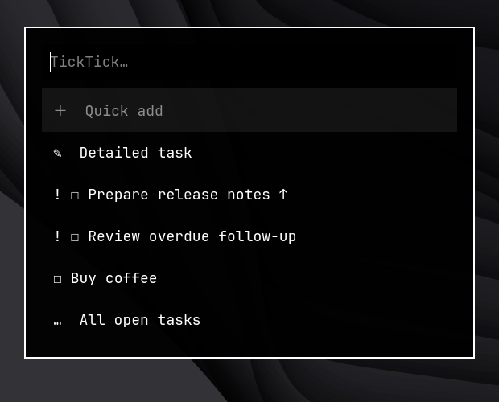
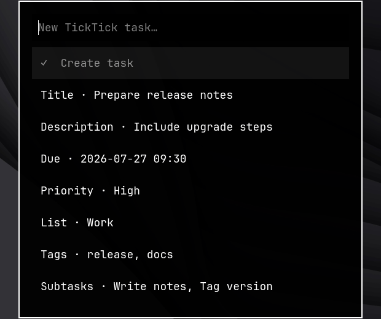

# TickTick Waybar

A small, Waybar-first TickTick client for Hyprland. Add and complete tasks
through Walker without opening the full app.






## Install

Requires Waybar, Walker, Node.js 20+ and npm.

```bash
git clone https://github.com/KigoJomo/ticktick-waybar.git ~/.local/share/ticktick-waybar
~/.local/share/ticktick-waybar/install.sh
```

The installer opens TickTick's browser OAuth, installs the CC0 TickTick brand
glyph, backs up the active Waybar files, adds a separate pill beside the centre
widgets and reloads Waybar. After OAuth, it restricts the official CLI's
credential directory and token file to the current user.

## Use

| Action | Result |
| --- | --- |
| Hover | Preview overdue and today's tasks |
| Left-click | Complete a task or open quick/detailed creation |
| Right-click | Add a task to Inbox |
| Middle-click | Open TickTick Today |

The bar shows the number of overdue and due-today tasks. When TickTick is
offline, the last successful result remains visible in a stale state.
Inbox is discovered from TickTick's global task filter and cached locally;
Notes are excluded from the completion menu.
Walker opens from the last cached snapshot so API latency never blocks the
menu. Status polling and every successful mutation keep that snapshot current.

The same actions are available from the terminal:

```bash
tickbar menu
tickbar add
tickbar add --details
tickbar auth
tickbar refresh
```

Detailed creation is a small Walker editor. Set only the fields you need, then
choose `Create task`. It supports description, due date or local time, priority,
list, tags and comma-separated subtasks. Dates accept `today`, `tomorrow`,
`YYYY-MM-DD` or `YYYY-MM-DD HH:MM`; local times use the configured timezone.

## Configure

The installer accepts alternate Waybar paths and positions:

```bash
./install.sh \
  --waybar-config ~/.config/waybar/config.jsonc \
  --waybar-style ~/.config/waybar/style.css \
  --position center
```

Optional runtime settings live at
`~/.config/ticktick-waybar/config.json`:

```json
{
  "cacheMinutes": 5,
  "defaultProjectId": null,
  "tooltipLimit": 8,
  "timeZone": "Africa/Nairobi",
  "todayUrl": "https://ticktick.com/webapp/#q/all/today"
}
```

TickTick's official API does not expose Inbox in its project list. The module
normally discovers its `inbox…` ID from existing tasks. On a completely empty
account, set `defaultProjectId` once to the target list ID shown by
`ticktick project list --json`.

Update with `git pull && ./install.sh --no-auth`.

## Uninstall

```bash
./uninstall.sh
```

Add `--purge` to sign out and remove TickTick Waybar's cache, state and runtime
configuration. Timestamped Waybar backups remain under
`~/.config/waybar/.ticktick-waybar-backups/`.

## Development

```bash
npm ci
npm run verify
```

The TickTick adapter uses the official
[`@ticktick/ticktick-cli`](https://github.com/TickTeam/ticktick-cli).
The TickTick glyph comes from
[`simple-icons-font`](https://github.com/simple-icons/simple-icons-font);
see [THIRD_PARTY_NOTICES.md](THIRD_PARTY_NOTICES.md).

## Licence

MIT
